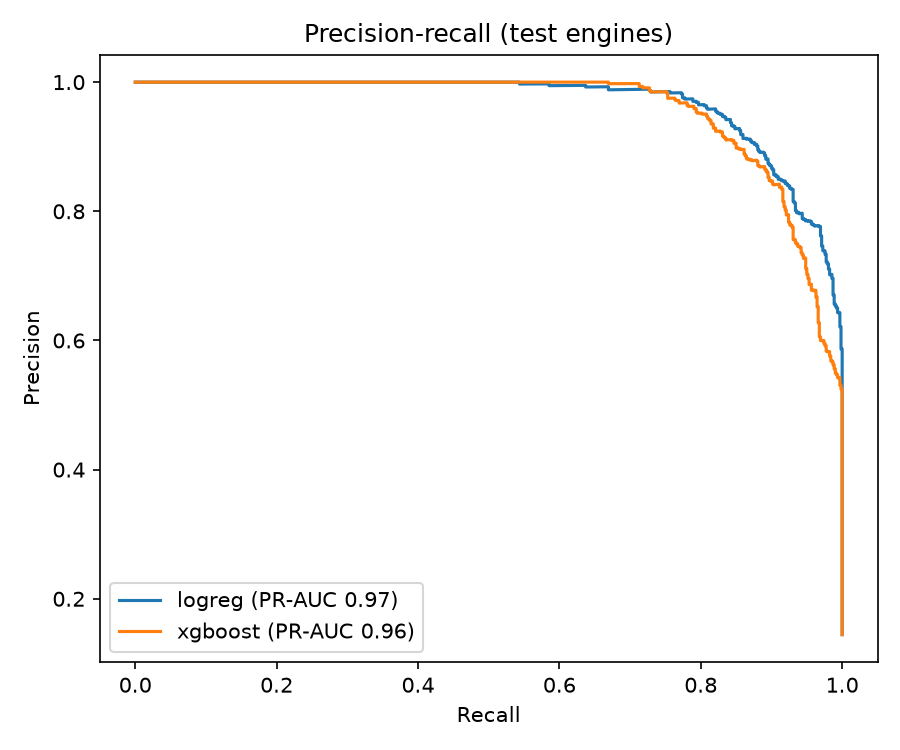
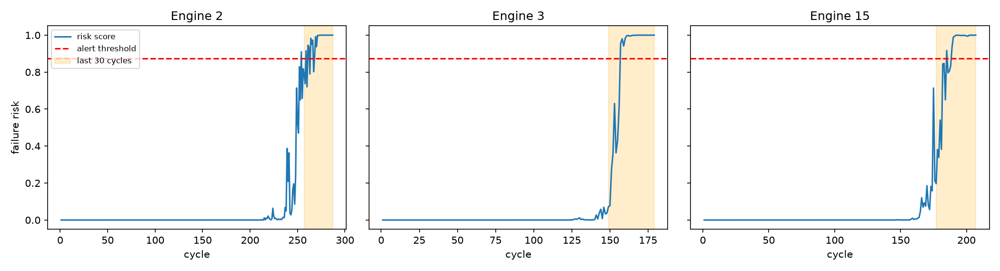
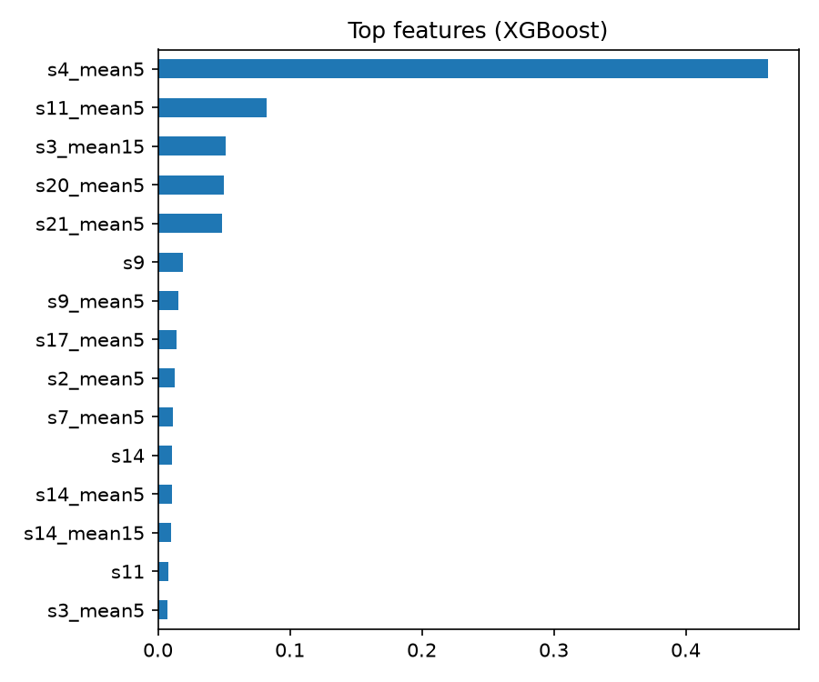

# Predictive Maintenance (NASA C-MAPSS turbofan, FD001)

Predicts, for every engine at every operating cycle, whether it will fail within the next 30 cycles, so maintenance can be scheduled before a breakdown.

## Data
NASA C-MAPSS Turbofan Engine Degradation Simulation, subset FD001: 100 engines run to failure (20,631 engine-cycles), with 21 sensors and 3 operating settings per cycle. 15.0% of rows fall in the last 30 cycles before failure.
Sensors and settings that never change are dropped, leaving 17 inputs.
The raw data is not stored in this repository (download link in "How to run").

## Approach
1. **Label:** remaining useful life = last cycle of the engine minus current cycle. A row is positive when remaining life is 30 cycles or less.
2. **Features (no future data):** current value, 5-cycle rolling mean and standard deviation, 15-cycle rolling mean, and change versus 5 cycles ago for each input, plus the cycle count. Rolling windows only look backwards.
3. **Split by engine:** 60 / 20 / 20 engines for train / validation / test. Rows are never split randomly, because neighbouring cycles of one engine are almost identical and would leak.
4. **Rare failures:** class weights (logistic regression) and `scale_pos_weight` (XGBoost) instead of resampling.
5. **Alert threshold:** chosen on validation engines as the highest-precision threshold that still catches at least 80% of at-risk rows.
6. **Metrics:** PR-AUC, precision, recall, number of false alarms, plus engine-level results (engines warned in time, warning lead time, false-alarm cycles per engine).
7. **Monitoring view:** a Streamlit app shows fleet status (ALERT / WATCH / OK) at any chosen cycle, a downloadable alert list, and the risk history of each engine.

## Results

Validation engines (20 engines, threshold set for recall of at least 80%):

| Model | PR-AUC | ROC-AUC | Precision | Recall | F1 | False alarms | Threshold |
|---|---|---|---|---|---|---|---|
| Logistic Regression | 0.958 | 0.991 | 0.940 | 0.802 | 0.865 | 32 | 0.873 |
| XGBoost | 0.948 | 0.989 | 0.910 | 0.800 | 0.852 | 49 | 0.652 |

Held-out test engines (20 engines), best model Logistic Regression at alert threshold 0.873:

| Metric | Value |
|---|---|
| PR-AUC | 0.968 |
| ROC-AUC | 0.994 |
| Precision | 0.942 |
| Recall | 0.835 |
| F1 | 0.885 |
| False-alarm cycles (total) | 32 |
| Engines warned before failure | 20 of 20 (100%) |
| Median warning lead time | 27 cycles |
| Engines with at least one false alarm | 55% |
| False-alarm cycles per engine | 1.6 |

Notes:
- A "false alarm" here is an alert raised while the engine still has more than 30 cycles of life left. 55% of test engines had at least one, but the average is only 1.6 such cycles per engine.
- Logistic Regression slightly beat XGBoost on validation (PR-AUC 0.958 vs 0.948) with fewer false alarms, so the simpler model was selected. The FD001 degradation pattern is smooth, which suits a linear model.
- The warning lead time is how many cycles before failure the first in-window alert appeared (median 27 of a possible 30).





## How to run
```bash
pip install -r requirements.txt
# Download "Turbofan Engine Degradation Simulation" from https://data.phmsociety.org/nasa/
# and unzip it (including the inner CMAPSSData.zip) anywhere under data/.
python src/maintenance_pipeline.py
streamlit run app.py
```

## Outputs
- `outputs/model_comparison.csv`: validation metrics
- `outputs/test_metrics.csv`: final test metrics (row and engine level)
- `outputs/test_predictions.csv`: risk score for every test engine and cycle
- `outputs/*.png`: plots used above

## Limitations
- Simulated data from one operating condition (FD001), so results are optimistic compared with a real fleet.
- Only 20 test engines, so the numbers can move noticeably with a different split.
- The test engines come from the run-to-failure training file, so every engine fails; the official truncated test file is not used.
- The 30-cycle window and the 80% recall target are assumptions, not measured business needs.